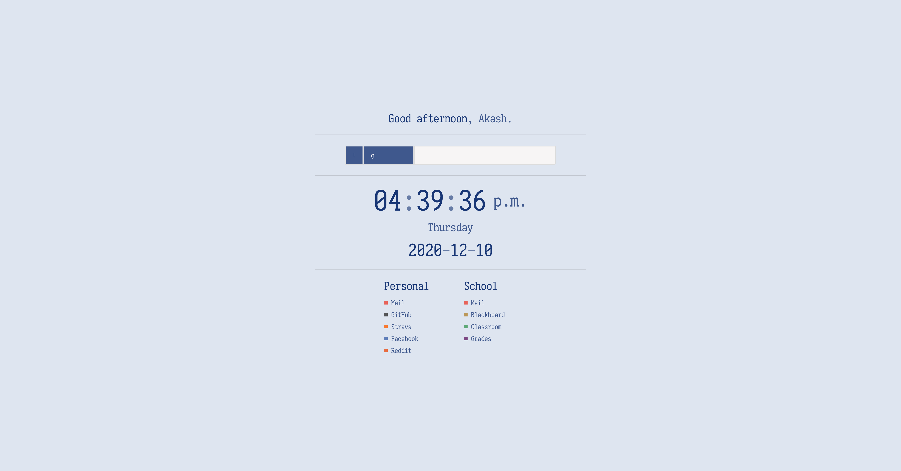

# Start Page

The page uses the "bang" feature from DuckDuckGo to allow for searching on a variety of sites.

## Screenshot



## Develop

Install the dependencies:

```bash
cd svelte-app
npm install
```

start [Rollup](https://rollupjs.org):

```bash
npm run dev
```

Navigate to [localhost:5000](http://localhost:5000). You should see your app running. Edit a component file in `src`, save it, and reload the page to see your changes.

By default, the server will only respond to requests from localhost. To allow connections from other computers, edit the `sirv` commands in package.json to include the option `--host 0.0.0.0`.

## Production

To create an optimised version of the app:

```bash
npm run build
```

You can use `npm run start` to run a production server with `sirv`. On my computer, I use [miniserve](https://github.com/svenstaro/miniserve) to serve the files efficiently. Also, Rust.
